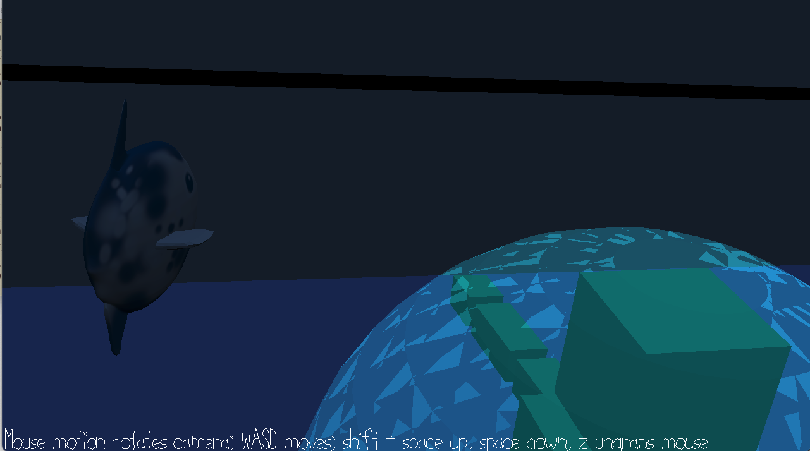

# Sunfish Survival
Author: Emily Amspoker

Design: This is a stealth game where you play as a sunfish trapped in a swimming pool. If you touch someone swimming, you die (this is inspired by the fact that sunfish are associated with dying easily).

Screen Shot:

How To Play:

Escape the pool by finding the translucent vent in the ground. Avoid colliding with the people swimming in the pool. Use WASD to move in the xy plane, and space/space+shift to move down and up, respectively. If you die or win and would like to play again, simply click.

This game was built with [NEST](NEST.md).
